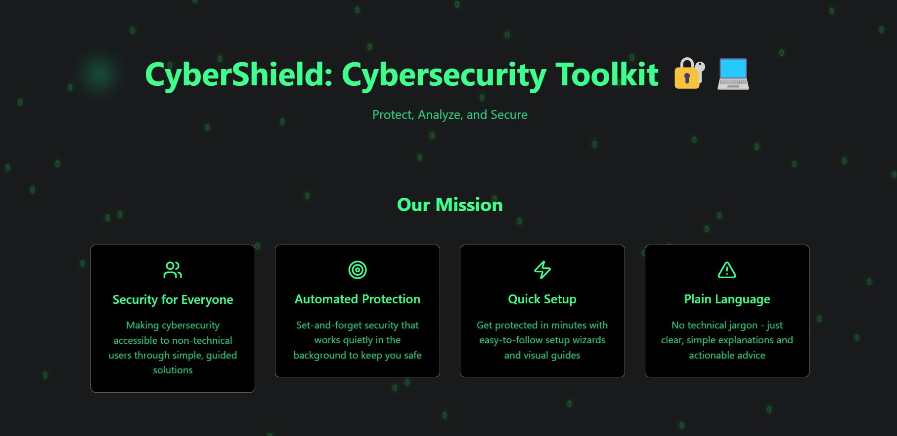
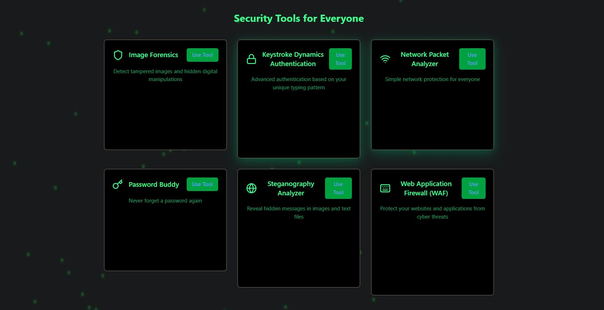
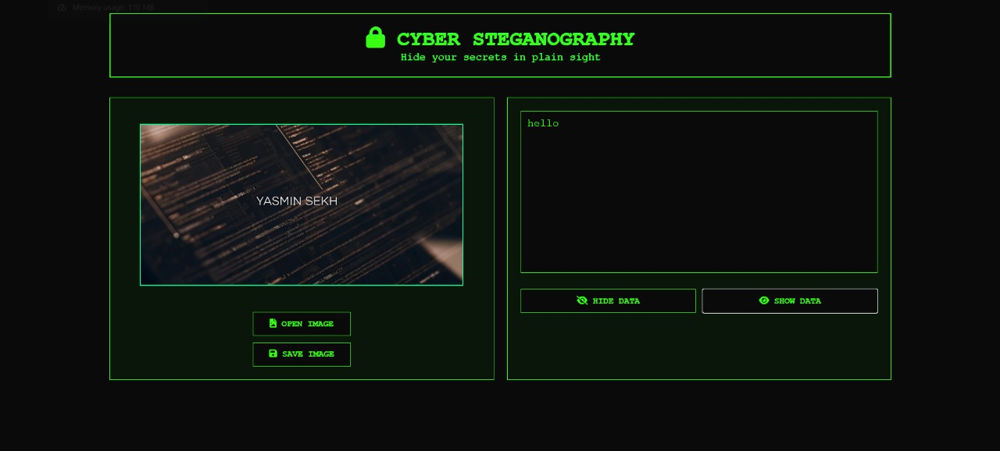
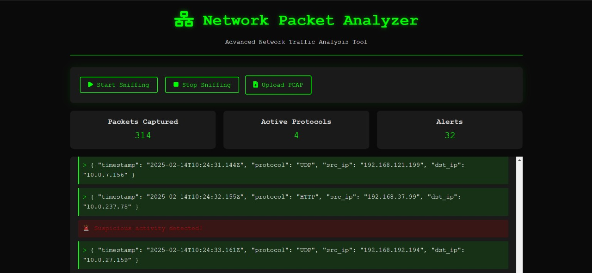
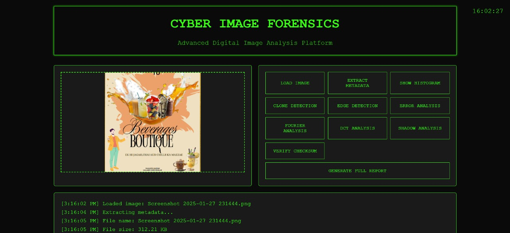
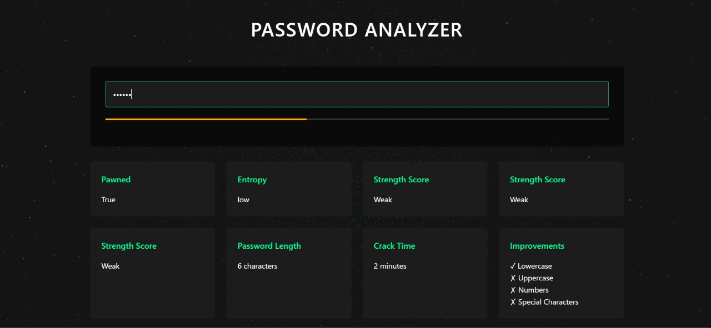
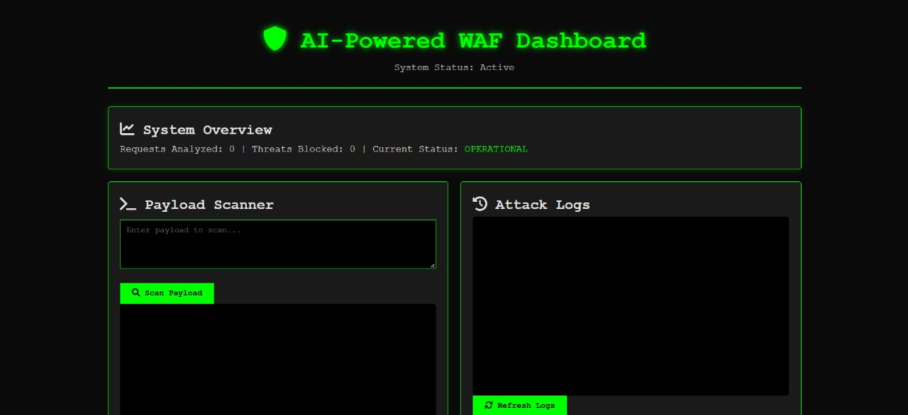

# 🔒 CyberShield – Advanced Cybersecurity Web Application

**CyberShield** is a comprehensive Machine Learning Based cybersecurity toolkit designed to enhance digital security through **password analysis, phishing detection, Keystroke Dynamic Authentication, packet sniffing, steganography and an AI-powered Web Application Firewall (WAF)**. It helps users detect threats, strengthen passwords, and secure sensitive information.

## 🚀 Features

- **🔑 Password Strength Checker** – Evaluates password security.
- **🌐 Phishing URL Detection** – Identifies malicious websites.
- **📡 Packet Sniffing** – Monitors network traffic.
- **🖼️ Steganography** – Hides and extracts hidden messages in images.
- **⌨️ Keystroke Dynamics Authentication** – Behavioral authentication system.
- **🛡️ AI-Powered Web Application Firewall (WAF)** – Protects against web attacks.

## 🛠 Tech Stack

| Component | Technology |
|-----------|-----------|
| **Frontend** | React.js, Tailwind CSS |
| **Backend** | Flask, Python |
| **Database** | PostgreSQL |
| **Security Libraries** | OpenCV, Scikit-learn, Cryptography, PyShark |
| **Deployment** | Docker, AWS/GCP |

## 📦 Installation Guide

### 1️⃣ Clone the Repository
```bash
git clone https://github.com/YASMIN-SEKH/CyberShield.git
cd CyberShield
```

### 2️⃣ Backend Setup
- Install Python Dependencies:
```bash
cd backend
python -m venv venv
source venv/bin/activate  # On Windows: venv\Scripts\activate
pip install -r requirements.txt
```

### Configure Environment Variables:
Create a .env file in the backend folder and set up required credentials.
- Run Flask Backend:
```bash
python app.py
```

### 3️⃣ Frontend Setup
- Install Node.js Dependencies:
```bash
cd ../frontend
npm install
```

### Start React Application:
```bash
npm start
```

**screenshots**









